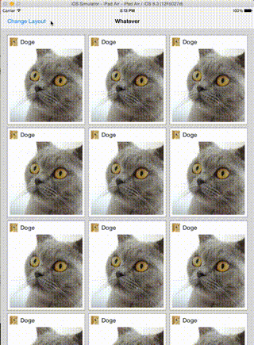

# Layout-To-Layout Transitions in Swift (3.x)

## Demonstration

##Implementation Details

Swift v3.x
Xcode 8.3.x

There's no storyboard, and the only XIB used is to design the collection view cell.

This is the initial view controller hierachy:

    - [UINavigationController]
    |-- [ViewController layout:normal]

    normal: CollectionViewFlowLayout

When the button "Change Layout" is pressed, the view hierarchy changes to:

    - [UINavigationController]
    |-- [ViewController layout:normal]
        |--[ViewController layout:expanded]

    normal: CollectionViewFlowLayout
    expanded: CollectionViewExpandedFlowLayout

The transition is performed via a layout-to-layout transition using Apple iOS 7 API.

The "normal" layout enforces 3 items per row on iPads, and just one item for iPhones.

The "expanded" layout enforces 1 item per row, and the item's width is the same of the collection view.

##License

    Copyright (c) 2015-2017 Matteo Pacini

    Permission is hereby granted, free of charge, to any person obtaining a copy
    of this software and associated documentation files (the "Software"), to deal
    in the Software without restriction, including without limitation the rights
    to use, copy, modify, merge, publish, distribute, sublicense, and/or sell
    copies of the Software, and to permit persons to whom the Software is
    furnished to do so, subject to the following conditions:

    The above copyright notice and this permission notice shall be included in
    all copies or substantial portions of the Software.

    THE SOFTWARE IS PROVIDED "AS IS", WITHOUT WARRANTY OF ANY KIND, EXPRESS OR
    IMPLIED, INCLUDING BUT NOT LIMITED TO THE WARRANTIES OF MERCHANTABILITY,
    FITNESS FOR A PARTICULAR PURPOSE AND NONINFRINGEMENT. IN NO EVENT SHALL THE
    AUTHORS OR COPYRIGHT HOLDERS BE LIABLE FOR ANY CLAIM, DAMAGES OR OTHER
    LIABILITY, WHETHER IN AN ACTION OF CONTRACT, TORT OR OTHERWISE, ARISING FROM,
    OUT OF OR IN CONNECTION WITH THE SOFTWARE OR THE USE OR OTHER DEALINGS IN
    THE SOFTWARE.
